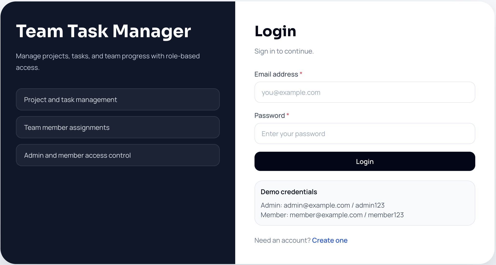
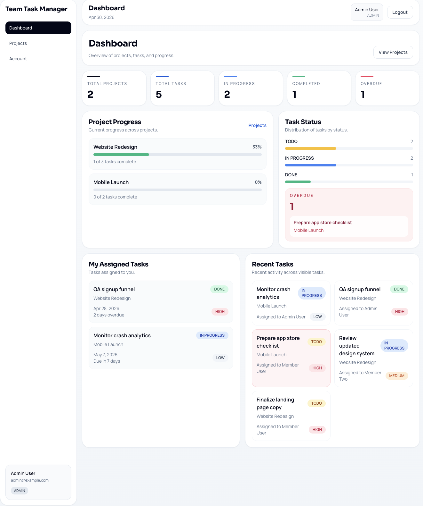
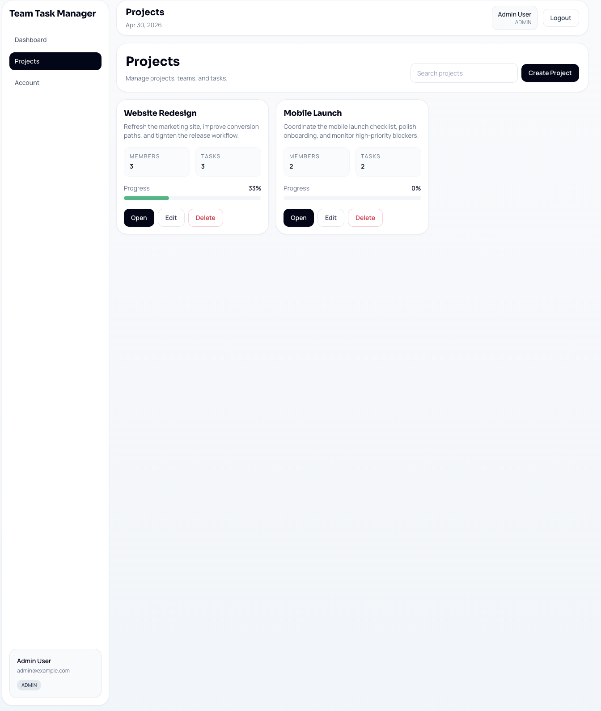
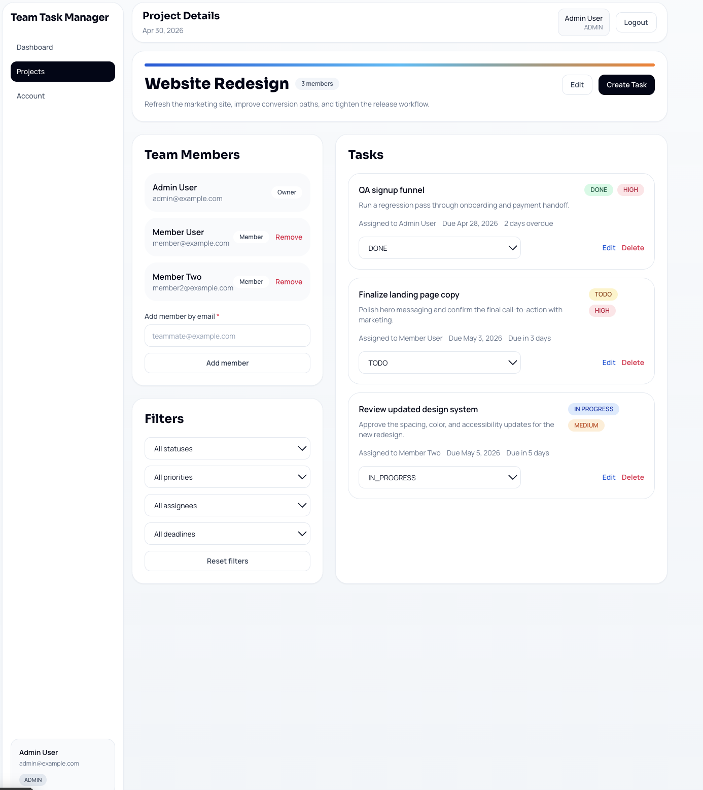

# Team Task Manager

Team Task Manager is a production-ready full-stack project management system designed to demonstrate real-world backend architecture, role-based access control, and scalable task workflows.

It allows teams to create projects, manage members, assign tasks, and track progress through a secure API-driven system with strict backend authorization.

---

## Live Demo

* 🌐 Live App: https://team-task-manager-server-production-c341.up.railway.app
* 📂 GitHub Repository: https://github.com/SintuMishra/team-task-manager-fullstack
* 🎥 Demo Video: DEMO_VIDEO_LINK_HERE

---

## Overview

This project was built as part of a full-stack engineering assignment with the goal of implementing a realistic team collaboration system.

Core requirements included:

* Authentication with signup and login
* Project and team management
* Task creation, assignment, and status tracking
* Dashboard metrics and overdue visibility
* REST APIs with database-backed persistence
* Role-based access control (Admin / Member)
* Deployment readiness

The current implementation satisfies all requirements using a modern production-ready stack.

---

## Approach

This project focuses on backend correctness and real-world system design rather than just UI.

Key considerations:

* Enforcing role-based access control at the backend level
* Designing proper relationships between users, projects, and tasks
* Ensuring predictable API responses and validation
* Handling edge cases such as empty dashboards and unauthorized access

---

## Key Features

* User signup, login, logout, and session handling
* JWT-based authentication with bcrypt password hashing
* Backend-enforced RBAC for `ADMIN` and `MEMBER` roles
* Project creation, editing, and deletion (Admin only)
* Project member management via email
* Task creation, assignment, editing, and deletion
* Task status updates by assigned members
* Dashboard with:

  * Total projects and tasks
  * Task status breakdown
  * Overdue task tracking
  * Recent tasks and project progress
* Search and filtering for projects and tasks
* Responsive UI (desktop, tablet, mobile)
* Railway-ready deployment with health checks

---

## Roles and Permissions

| Capability                  | Admin | Member                    |
| --------------------------- | ----- | ------------------------- |
| View dashboard              | Yes   | Yes                       |
| View accessible projects    | Yes   | Yes                       |
| Create project              | Yes   | No                        |
| Edit project                | Yes   | No                        |
| Delete project              | Yes   | No                        |
| Add/remove members          | Yes   | No                        |
| Create/assign tasks         | Yes   | No                        |
| Edit/delete any task        | Yes   | No                        |
| Update assigned task status | Yes   | Yes (only assigned tasks) |

---

## Tech Stack

| Layer          | Tools                                   |
| -------------- | --------------------------------------- |
| Frontend       | React, Vite, React Router, Tailwind CSS |
| Backend        | Node.js, Express.js                     |
| Database       | PostgreSQL                              |
| ORM            | Prisma                                  |
| Authentication | JWT, bcrypt                             |
| Tooling        | Nodemon, Concurrently                   |
| Deployment     | Railway                                 |

---

## Architecture Overview

* `client/` → React frontend (SPA)
* `server/` → Express API + Prisma ORM
* API endpoints under `/api`
* Backend enforces authentication and RBAC via middleware
* In production, Express serves both API and frontend

---

## Folder Structure

```
team-task-manager-fullstack/
├── client/
├── server/
├── submission-assets/
├── railway.json
└── README.md
```

---

## Database Design

### Models

| Model         | Purpose                          |
| ------------- | -------------------------------- |
| User          | Stores account info and role     |
| Project       | Stores project details           |
| ProjectMember | Links users to projects          |
| Task          | Stores task data and assignments |

### Enums

* Role: ADMIN, MEMBER
* TaskStatus: TODO, IN_PROGRESS, DONE
* Priority: LOW, MEDIUM, HIGH

### Relationships

* One user → many projects
* One project → many members
* One project → many tasks
* One user → many assigned tasks

---

## API Endpoints

| Area      | Method | Endpoint                |
| --------- | ------ | ----------------------- |
| Auth      | POST   | /api/auth/signup        |
| Auth      | POST   | /api/auth/login         |
| Auth      | GET    | /api/auth/me            |
| Projects  | GET    | /api/projects           |
| Projects  | POST   | /api/projects           |
| Tasks     | POST   | /api/projects/:id/tasks |
| Tasks     | PATCH  | /api/tasks/:id/status   |
| Dashboard | GET    | /api/dashboard          |
| Health    | GET    | /api/health             |

---

## Environment Variables

### Required (Production)

```env
DATABASE_URL=${{Postgres.DATABASE_URL}}
JWT_SECRET=your_secret
FRONTEND_URL=https://your-app.up.railway.app
NODE_ENV=production
```

---

## Local Setup

```bash
npm install
cp .env.example .env
cp server/.env.example server/.env
cp client/.env.example client/.env

npm run prisma:generate
npm run prisma:migrate
npm run seed
npm run dev
```

---

## Demo Credentials

### Admin

* Email: [admin@example.com](mailto:admin@example.com)
* Password: admin123

### Member

* Email: [member@example.com](mailto:member@example.com)
* Password: member123

---

## Screenshots

### Login



### Dashboard



### Projects



### Project Details



---

## Deployment (Railway)

Steps followed:

1. Created Railway project
2. Added PostgreSQL database
3. Connected GitHub repo
4. Set environment variables
5. Ran Prisma migration and seed
6. Verified `/api/health`

---

## Testing Checklist

* Signup/login works
* RBAC enforced
* Admin actions restricted
* Member restrictions applied
* Dashboard loads correctly
* Tasks update correctly
* API returns valid responses

---

## Notes

* Prisma migrations must run before first use
* Seed script inserts demo users and data
* FRONTEND_URL is used for CORS
* Railway automatically assigns PORT

---

## Author

* Name: Sintu Mishra
* GitHub: https://github.com/SintuMishra

---
